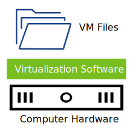
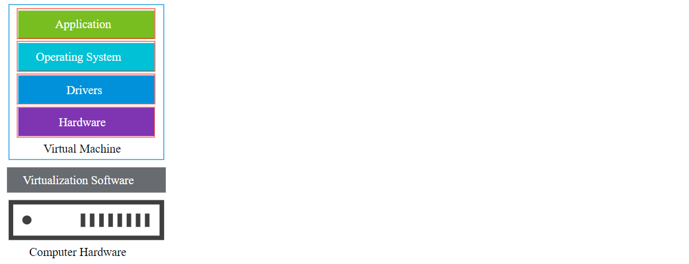
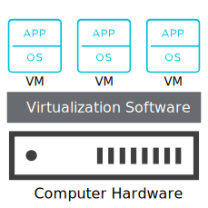
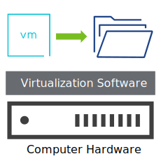
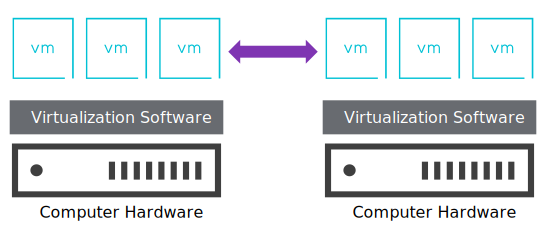
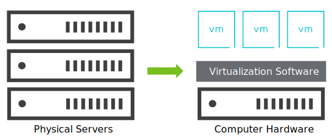

# Introduction to Virtual Machines

## Introduction

Virtual machines are not new. Many businesses use virtual machines for their flexibility and cost effectiveness. But what are virtual machines? And why are they so useful? To answer these questions, it helps to consider the problems that virtual machines were created to solve.

### Learner Objectives

- Describe how virtual machines work
- Recognize the benefits of using virtual machines

## Virtual Machines Explained

### From Traditional Servers to Virtualized Servers

#### From Traditional Servers to Virtualized Servers

To start, consider how traditional servers work, the problems they present, and how those problems might be solved.

A server is a computer that offers services to other computers, called clients, which are all connected over a network. For example, a web server provides client computers with access to websites over the Internet.

Typically, servers use special processors, memory, and other hardware resources that are more powerful than those of desktop computers. But the operating system running on a traditional server does not always consume the hardware resources at full capacity.

To look at it another way, consider that a server is like a large bus with one seat and passenger. The bus has space for other seats and passengers, but that space is not used. It is wasted. Every traveler must take their own bus to get to their destinations. Just imagine the number of buses that are required.

This example demonstrates an inefficient use of space, equipment, time, and fuel, similar to the way the traditional server uses its resources.

#### Problem: Wasted Server Resources

The problem with traditional servers is that too many servers are required and many end up being underutilized. Here is where the virtual machine (VM) comes in.

A virtual machine is a software representation of a physical computer. Like physical computers, a VM runs an operating system (OS) and one or more applications.

- An OS is a piece of software that controls the physical resources of a computer and runs applications. OS examples include Windows, Linux, and macOS.

- An application is a piece of software that runs on the OS. It performs tasks and consumes physical resources controlled by the OS. Application examples include Microsoft Office and Chrome web browser.

And, importantly, several copies of an OS can run on one physical machine. The operating systems on VMs are called guest operating systems. They are guests on the host (physical) computer.

Given what you have learned so far, how do you think VMs solve the problem of wasted server resources? *Select the best answer and click **Submit**.*

- [ ] By using all the server resources at the same time
- [ ] By reducing the number of resources that a single server holds
- [x] By running multiple VMs on a single server to balance the workloads

One physical server can host multiple VMs. You can condense multiple physical servers into fewer servers that run many virtual machines, making those physical servers more productive. The one-seat bus is converted into a bus with many seats that can take several passengers at once.

#### Solution: Virtual Machines

So a VM is a special type of software application that runs a guest OS. It is like a machine running inside another machine. By installing virtualization software on a physical server, the server can host multiple VMs, each one with its own OS.

With VMs, you can run multiple operating systems at the same time, from the same piece of hardware. Imagine that you have multiple application windows open in your computer at the same time. Each application represents a separate operating system that you can interact with. Without virtualization, running multiple systems requires separate physical units.

In the bus example, to use the resources more efficiently, you add more seats to the bus so that you can carry more passengers on a single trip.

Likewise, you use virtualization software to run multiple VMs on a server so that you can host multiple operating systems at the same time and avoid wasting resources.

### How Do Virtual Machines Work?

#### How Do Virtual Machines Work?

A VM can be represented as files that are kept in a folder. The folder is like a computer case. The files represent the components of the VM and the devices that are connected to the motherboard.

- The motherboard is the circuit board that provides connectivity between the hardware components. Hardware component examples include the processor (CPU) and memory (RAM).

In this example, the virtualization software is like an organizer. It keeps the files of multiple VMs organized, like folders inside a file cabinet (the computer hardware).

#### Components of Virtual Machines

The way that you interact with a VM is similar to how you interact with a physical machine. You power on the VM, load the operating system, and use a keyboard or a mouse to interact with the operating system and its applications. Every VM provides the same functionality as a physical machine because they use the same types of components.

**Exploring VM Components**

*Click each VM component to learn how common computer concepts apply to VMs.*

##### Application

Applications perform tasks using computer resources such as CPU, memory, and storage.

For example, when a web server application needs access to storage space, it asks the OS for this resource.

If this web server is running on a VM, it is the guest OS that presents the application with the storage space.

When client computers request access to websites, this web server responds to the client requests without ever knowing that the OS is running on a VM.

##### Operating System

Multiple guest operating systems that run on a single server share the physical resources of the host.

Virtualization software provides each guest OS with its own share of virtualized resources, such as CPU and memory.

For example, if two VMs are running on a server, each guest OS can access only a subset of resources and presents those resources to the applications that it runs.

##### Drivers

A driver is a software component that links a computer's hardware with the OS so that they can communicate with each other.

For example, operating systems come with drivers for basic operations such as controlling the keyboard.

VMware VMs include VMware Tools, a bundle of drivers that help guest operating systems interact efficiently with the guest hardware.

##### Hardware

The virtualization software abstracts the physical hardware and presents it as virtualized resources to the VM.

- To abstract something is to hide some of its details, those that are not immediately important. Take a smartphone, for example, all you need to know is which button to press. You do not need to know the computations that created that button, or what happens inside the phone when you press the buttons.

The guest OS uses the virtualized hardware devices of the VM but is unaware that those devices are virtual.

Examples of virtual machine hardware devices:

- CPU and memory devices
- Network adapters
- Disks and controllers
- Parallel and serial ports

### Benefits of Using Virtual Machines

You have learned how VMs help address the underutilization of resources. They also help address other challenges.

#### Isolation

Challenge that VM isolation addresses: Failures

If a guest OS experiences a failure because it runs beyond its specification limits, other VMs are not affected.

Why? Each VM is an isolated software container with an application and operating system. Problems that affect one guest operating system do not affect other VMs running on the same host.

#### Encapsulation

Challenge that VM encapsulation addresses: Portability

The files that make up a VM are usually stored together in the same folder. Using these files, you can perform the following actions:

- Save the entire state of a VM to files that are encapsulated together.
- Copy the VM files to create multiple replicas of the VM.
- Move a VM from one host to another to perform routine maintenance of the physical server.

#### Hardware Independence

Challenge that VM hardware independence addresses: Compatibility

You can move any VM to any physical server, without having to worry about the compatibility of the VM with the underlying hardware.

Virtualization provides a guest operating system with the virtual hardware that it requires.

If you need to use an OS that requires specific hardware,  VM can be provisioned with standardized software-based hardware.

#### Server Consolidation

Challenge that server consolidation addresses: Costs

Using VMs, you can run multiple operating systems on one physical machine.

In this way, you can reduce the number of physical servers and manage your virtual servers more efficiently:

- Reduce power, cooling, and maintenance costs
- Create time to focus on innovation
- Increase the efficient utilization of resources

#### Why Create VMs?

Your company is experiencing several problems that are creating inefficiencies in IT operations:

- Multiple operating systems
- Compatibility of hardware
- Limited number of physical servers

The company decides that creating virtual machines is the answer. Why? *Select all options that apply and click **Submit**.*

- [x] With virtualization, fewer physical servers are required.
- [ ] VMs do not require physical hardware to function.
- [ ] You can install more operating systems on a VM than on a physical server.
- [x] You can move VMs between physical servers without worrying about hardware compatibility.

## Summary

*Moving from traditional servers to virtualized ones brings many benefits. Computing tasks can be done on fewer computers, using less electricity and taking up less space, promising a way to control costs. In sum, virtual machines make computing easier.*

## Knowledge Check

### About Virtual Machines

Which statements accurately describe VMs?

| Statements                                                   | True | False |
| :----------------------------------------------------------- | :--: | :---: |
| VMs usually run multiple operating systems.                  |      |   x   |
| VMs can run without the hardware of a host machine.          |      |   x   |
| A VM is a software representation of a physical computer and its components. |  x   |       |
| Host machines can run more than one VM at the same time.     |  x   |       |
| A VM is like a machine running inside another machine.       |  x   |       |

### Components of Virtual Machines

Which component of a VM links a computer's hardware and software? *Select the option that best answers the question. Then click **Submit**.*

- [ ] Application
- [ ] Operating system
- [ ] Hardware
- [x] Driver

### Benefits of Virtual Machines

What benefits do VMs offer? Match the benefits to their corresponding descriptions. Then click **Submit**.

- Encapsulation
  - You can move a VM from one host to another to perform routine maintenance of the physical server.
- Isolation
  - If a guest OS experiences a failure, other VMs are not affected.
- Hardware independence
  - If you must use an OS that requires specific hardware, a VM can be provisioned with standardized software-based hardware.
- Server consolidation
  - VMs can reduce power, cooling, and maintenance costs by reducing the number of physical servers.

## Lesson Complete

